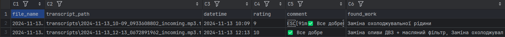

# 🔊 AutoService Audio Analyzer

Цей проєкт автоматично **транскрибує аудіозаписи** (наприклад, з телефонних розмов або записів прийому авто в сервісі)  
та **аналізує текст**, щоб визначити:
1. **Типи виконаних робіт** (на основі словника `WORK_TYPES`);
2. **Наявність небажаних фраз** (наприклад: “не знаю”, “чекайте”, “мені байдуже”);
3. Формує загальну **оцінку якості обслуговування (rating)**;
4. Зберігає результати в **`results.csv`**.

📦 Встановлення
1. Клонування проєкту 
**`git clone https://github.com/yourname/AutoServiceAudioAnalyzer.git`**

2. Встановлення залежностей
**`pip install -r requirements.txt`**

3. Перевірка, що FFmpeg встановлено

(потрібен для роботи Whisper)

**`ffmpeg -version`**

🚀 Запуск

Скопіюй аудіофайли в папку audio/, а потім запусти:

**`python main.py`**

По завершенню:

у transcripts/ з’являться тексти кожного файлу;

у results.csv — таблиця з результатами аналізу.

## Приклад отриманої інформації

